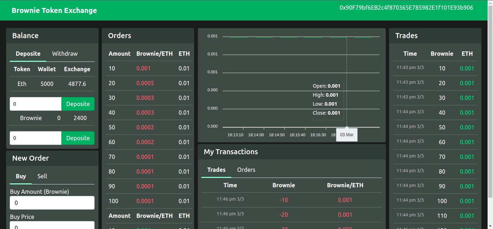

# Token exchange :money_mouth_face:
decentralized ERC-20 token (Brownie token ) exchange .



### Tech stack & packages used :man_technologist:
- React.js ,solidity ,hardhat ,mocha, chai, ether.js, web3.js,lodash, apexcharts & waffle
### Token exchange features :tada:
- [x] Deposite & withdraw ether.
- [x] Deposite & withdraw token.
- [x] Buy & sell token.
- [x] Maintain trade (Create order,fill order & cancel order).
- [x] Realtime updates.

### How to run :runner: :
----------------
- Run hardhat node
    ```
    npx hardhat node
    ```
- Run test cases
    ```
    npx hardhat test
    ```
- Deploy contract in local hardhat node
    ```
    npx hardhat run scripts/deploy.js --network localhost
    ```
- Connect hardhat with metamask
- Run react frontend
    ```
    cd client
    npm start
    ```
### Web3.js 
------------
- [Load web3](https://web3js.readthedocs.io/en/v1.2.11/web3-eth.html#web3-eth)
- [Connect with contract](https://web3js.readthedocs.io/en/v1.2.11/web3-eth-contract.html#web3-eth-contract)
    ```
    new web3.eth.Contract(jsonInterface[, address][, options])
    ```
- [Callback promises events](https://web3js.readthedocs.io/en/v1.2.11/callbacks-promises-events.html#callbacks-promises-events)
    ```
    .on('transactionHash', function(hash){ ... })
    .on('error', function(error){ ... })
    ```
- [Subscribe to event](https://web3js.readthedocs.io/en/v1.2.11/web3-eth-contract.html#contract-events)
    ```
    contractName.events.EventName([options][, callback])
    ```
- [Fetch all data from contract event](https://web3js.readthedocs.io/en/v1.2.11/web3-eth-contract.html#getpastevents)
    - <small> An array with the past event Objects, matching the given event name and filter.</small>

    ```
    contractName.getPastEvents(EventName[, options][, callback])
    ```

### Hardhat commands
```shell
npx hardhat accounts
npx hardhat compile
npx hardhat clean
npx hardhat test
npx hardhat node
node scripts/deploy.js
npx hardhat run scripts/seed.js
npx hardhat help
npx hardhat run scripts/deploy.js --network <network name>
```
